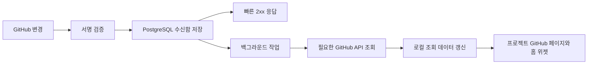

# GitHub 저장소 연동·전용 페이지·홈 위젯 검토

작성일: 2026-09-16
상태: 요구사항 검토 및 제안. 구현·인프라 생성·GitHub App 등록은 수행하지 않았다.

## 1. 권장 방향

프로젝트마다 여러 GitHub Repository를 연결하고, **위젯 하나는 저장소 하나의 정보 종류 하나만** 표시한다. 같은 저장소의 Commit과 Issue를 보고 싶으면 위젯을 각각 추가한다. 같은 정보 종류도 브랜치·필터를 달리해 여러 개 추가할 수 있다.

GitHub App을 설치해 선택된 저장소에 읽기 권한을 부여하고, Webhook을 변경 신호로 받아 필요한 데이터만 GitHub API로 동기화하는 방식을 권장한다. 백엔드는 PostgreSQL에 동기화 결과를 저장하고 화면은 이 로컬 조회 API를 사용한다. GitHub 원본은 GitHub에 있으며, 로컬 데이터는 지연될 수 있는 복제 조회 데이터다.

상시 Repository 상태 폴링은 하지 않는다. 다만 최초 연결·새 조회 범위 추가·명시적 재동기화·누락 복구에는 API 조회가 필요하다. **Webhook만으로 최초 상태와 모든 변경의 전달을 보장할 수는 없다.** 실패한 전달을 GitHub가 자동 재전송하지 않으므로 복구 정책이 필요하다. [GitHub 실패 전달 안내](https://docs.github.com/en/webhooks/using-webhooks/handling-failed-webhook-deliveries)

이 문서는 구현 PLAN이나 승인된 아키텍처 결정이 아니다. 아래 모델·API·단계는 제안이며 구현 승인 후 별도 계획에서 확정한다. 취소된 PLAN-0012의 Redis 구현을 재개하거나 Redis를 전제로 하지 않는다.

## 2. 현재 저장소에서 확인한 사항

| 현재 코드 | 확인 내용과 영향 |
| --- | --- |
| [DashboardWidget](../../src/main/java/com/kopite/devspace/dashboard/domain/DashboardWidget.java) | 허용 type은 overview/board/deploy/links/journal/milestone. GitHub 종류·저장소 참조·전용 필터는 아직 없음 |
| [DashboardWidgetRequest](../../src/main/java/com/kopite/devspace/dashboard/presentation/dto/DashboardWidgetRequest.java) | 동일 type 반복을 허용하므로 같은 종류의 GitHub 위젯 여러 개라는 UX와 맞음. 현재 limit은 1~20 |
| [DashboardSelection](../../src/main/java/com/kopite/devspace/dashboard/domain/DashboardSelection.java) | all/uncategorized/project/category 선택만 지원. GitHub 저장소 선택을 기존 projectId에 억지로 넣지 않아야 함 |
| [HomeDashboard](../../src/main/java/com/kopite/devspace/dashboard/domain/HomeDashboard.java) | schemaVersion=2, JSONB 위젯 목록, dashboard revision 기반 수정 충돌 처리. 새 스키마의 호환 전략 필요 |
| [HomeDashboardCommandService](../../src/main/java/com/kopite/devspace/dashboard/application/HomeDashboardCommandService.java) | workspace lock 뒤 저장·dataRevision 증가. 위젯 설정 변경은 이 계약 유지 |
| [HomeDashboardController](../../src/main/java/com/kopite/devspace/dashboard/presentation/HomeDashboardController.java) | `/api/v2/dashboards/home`은 레이아웃 GET/PUT, 전체 교체·409 충돌·CSRF 계약. 저장소 내용 조회를 레이아웃 응답에 모두 넣지 않음 |
| [Security 지침](../agents/SECURITY.md), [Architecture 지침](../agents/ARCHITECTURE.md) | 외부 연동 자격증명과 사용자 로그인 분리, 서버 측 비밀 보관, 기능별 패키지와 Port/Adapter 경계 사용 |

프론트 코드는 이번 조사 범위가 아니다. 아래 화면 경로는 기존 라우터와 대조하지 않은 제안이다.

## 3. 화면과 사용자 흐름

### 프로젝트 상세의 GitHub 페이지

- `프로젝트 → 프로젝트 상세 → GitHub` 탭 또는 메뉴를 진입점으로 둔다. 독립 URL 예: `/projects/:projectId/github`.
- GitHub 페이지 상단에는 연결된 Repository 목록과 저장소 추가·해제, 연결 상태, 마지막 성공 동기화 시간을 표시한다.
- 저장소를 선택하면 Commit / Issue / Pull Request / Branch 탭을 제공한다. 이후 Actions / Release 등을 별도 탭으로 확장한다.
- 저장소 상세 URL 예: `/projects/:projectId/github/:repositoryLinkId`. 여기서 Repository 연결 ID는 앱 내부 ID이며 GitHub installation ID가 아니다.
- 목록 항목은 GitHub 원문으로 이동할 수 있다. 초기에는 Issue 수정·PR merge 등 GitHub 쓰기 작업을 제공하지 않는다.
- 프로젝트 상세는 설정과 깊은 탐색, 홈 위젯은 설정한 정보의 빠른 확인에 집중한다. 초기에는 전역 GitHub 메뉴까지 중복해서 만들 필요가 없다.

연결 흐름: 앱 로그인 → GitHub 계정 연결/권한 확인 → GitHub App 설치 또는 기존 설치 선택 → 접근 가능한 Repository 선택 → 해당 프로젝트에 연결 → 최초 동기화 → 위젯 추가. 조직 설치 승인이 필요한 경우 `승인 대기`로 안내하고 완료 전 성공으로 표시하지 않는다.

### 홈 위젯

위젯 추가: 프로젝트 선택 → 연결된 Repository 선택 → 정보 종류 **하나** 선택 → 해당 종류 필터·표시 개수·제목·크기 설정.

예를 들어 같은 프로젝트의 frontend Repository에 `main 커밋`, `열린 버그 이슈`, `리뷰 대기 PR`을 추가하면 세 위젯이다. backend Repository의 Commit은 별도 위젯으로 추가한다. 전체 활동을 뒤섞는 종합 피드는 초기 범위에서 제외한다.

초기 정보 종류는 `commits`, `issues`, `pullRequests`, `branches` 네 가지를 권장한다. 위젯의 `type=github` 아래 `resourceKind`를 단일 enum으로 두는 안이 적합하다. 배열이나 여러 종류를 동시에 받지 않는다. 타입별 필터를 검증하며 Issue 전용 필터를 Commit 위젯에 넣으면 저장을 거부한다.

위젯 설정 예시(기존 API에 바로 보낼 수 있는 스키마가 아닌 제안):

```json
{
  "id": "github-main-commits",
  "type": "github",
  "title": "백엔드 main 커밋",
  "size": "medium",
  "selection": { "kind": "project", "projectId": "<project-uuid>" },
  "github": {
    "repositoryLinkId": "<link-uuid>",
    "resourceKind": "commits",
    "filters": { "branch": "main" }
  },
  "limit": 5
}
```

같은 조건의 여러 위젯은 동일 조회 결과를 재사용할 수 있다. 화면 진입마다 GitHub를 조회하거나 위젯 수만큼 동일 동기화를 실행하지 않는다. 연결 해제된 위젯은 자동 삭제하지 않고 `연결 해제됨`과 재설정 동작을 표시한다. 권한 상실 시에는 이전 private 데이터가 그대로 노출되지 않도록 내용을 가린다.

## 4. 표시 정보와 GitHub 기능 매핑

아래 권한은 GitHub App의 읽기 권한을 기준으로 한 후보다. 실제 등록 시 endpoint와 Webhook별 요구 권한을 함께 확인하며, 사용하지 않는 기능의 권한을 미리 요청하지 않는다. [권한 선택](https://docs.github.com/en/apps/creating-github-apps/registering-a-github-app/choosing-permissions-for-a-github-app)

| 종류 / 우선순위 | 사용자 설정과 표시 내용 | API·변경 신호 | 제약 |
| --- | --- | --- | --- |
| Commit / 필수 | 브랜치, 개수. SHA·메시지·작성자·시각·원문 링크 | Commits API; `push`. Contents read | 기본 브랜치와 특정 브랜치 구별. force push 후 이전 SHA 목록을 현재 이력으로 남기지 않음 |
| Issue / 필수 | open/closed, 라벨, 담당자, 정렬, 개수 | Issues API; `issues`, 필요 시 `issue_comment`, `label`, `milestone`. Issues read | Issue API의 PR 항목을 제외. 댓글 전체 수집은 초기 제외 |
| Pull Request / 필수 | open/closed/merged, base branch, draft 여부, 개수 | Pulls API; `pull_request`, `pull_request_review`, 필요 시 review comment/thread. Pull requests read | closed와 merged는 다름. merge 가능 여부가 미정이면 unknown 표시 |
| Branch / 필수 | 이름 검색, 기본 브랜치 구분, 최근 head SHA | Branches API; `create`, `delete`, `push`, `repository`. Contents read | 최근 활동은 head commit 시각 기준. 생성 시각이나 마지막 push 시각과 혼동 금지 |
| Actions 실행 / 추가 1순위 | workflow·branch·실패만 보기, 상태·결과·실행 시간 | Workflow runs API; `workflow_run`, 필요 시 `workflow_job`. Actions read | 실패/진행 중/취소 구별. 로그·artifact 다운로드는 초기 제외 |
| Release / 추가 1순위 | 최신 릴리스, prerelease 포함, 태그·게시일·노트 링크 | Releases API; `release`. Contents read | draft는 권한·조회 범위에 맞춰 별도 취급. tag 생성과 release 발행은 다름 |
| 리뷰 요청 / 후속 | 나에게 요청된 PR, 리뷰 상태·대기 시간 | Pulls/reviews API; PR/review 관련 이벤트 | GitHub 사용자 ID 연결 필요. 팀 리뷰 요청까지 포함할지는 별도 범위 |
| 배포 상태 / 후속 | environment별 최신 배포와 성공/실패 | Deployments/statuses API; `deployment`, `deployment_status`. Deployments read | GitHub에 실제 배포 기록을 남기는 시스템만 보임. Render 배포가 자동으로 포함된다고 가정하지 않음 |
| CI checks / 후속 | 선택 branch/PR의 check 결과 | Checks/status API; `check_run`, `check_suite`, `status`. Checks/Commit statuses read | Actions와 다른 종류. PR 카드의 보조 상태 또는 독립 위젯 중 선택 |
| Milestone / 후속 | 기한·열림/닫힘·진행률 | Milestones/Issues API; `milestone`, `issues`, `pull_request` | GitHub의 진행률에 PR 포함 여부를 명시. 앱 자체 마일스톤과 자동 병합하지 않음 |
| 보안 알림 / 별도 선택 | 미해결 Dependabot 등 심각도별 알림 | 보안 API; 해당 alert 이벤트 | 추가 권한과 저장소별 기능/플랜 가용성 확인 필요. 홈에 민감한 상세 노출 금지 |

Webhook 이벤트 이름과 구독 가능 범위는 [이벤트 명세](https://docs.github.com/en/webhooks/webhook-events-and-payloads)를 기준으로 한다. 실제 구현에는 action별 처리 표가 추가로 필요하다.

API 세부 근거: [Commits](https://docs.github.com/en/rest/commits/commits), [Issues](https://docs.github.com/en/rest/issues/issues), [Pull requests](https://docs.github.com/en/rest/pulls/pulls), [Branches](https://docs.github.com/en/rest/branches/branches), [Workflow runs](https://docs.github.com/en/rest/actions/workflow-runs), [Releases](https://docs.github.com/en/rest/releases/releases).

Commit 작성자·기간·파일 경로 필터, 브랜치 간 ahead/behind 비교는 추가할 가치가 있다. 다만 로컬에 최근 몇 건만 저장한 상태에서 이런 필터를 적용하면 누락되므로, 필요한 수집 범위와 비교 API 비용을 정한 뒤 확장한다. 표시 개수 5와 수집 개수 5는 같은 의미가 아니다.

## 5. 연동 방식과 권한 경계

| 방식 | 장점 | 한계 / 판단 |
| --- | --- | --- |
| GitHub App | 선택 저장소 설치, 기능별 권한, installation 기반 동기화, App Webhook | 앱 등록·설치 승인 흐름 필요. 여러 Repository와 private 저장소를 다루므로 권장 |
| OAuth App + Repository Webhook | 사용자 권한으로 API 사용 가능 | 사용자 토큰·저장소별 hook 등록/관리 부담, 설치 수명주기 일관성 부족. 우선안 아님 |
| PAT 수동 입력 | 개인 실험에 간단 | 비밀 복사·만료·권한 관리 부담. 제품 기본 연결 방식으로 비권장 |
| 공개 저장소 URL만 등록 | 연결 UX가 간단 | 접근 권한 없는 저장소에 App 설치/Webhook 설정은 불가. 임의 공개 저장소의 Webhook 동기화를 약속하지 않음 |

GitHub App은 설치 시 허용할 Repository를 선택할 수 있고, installation access token으로 그 범위의 API를 사용할 수 있다. 동기화 토큰은 서버에서 발급·관리하며 브라우저에 전달하지 않는다. 앱 로그인을 GitHub 로그인으로 교체할 필요는 없다. [GitHub App 설치](https://docs.github.com/en/apps/using-github-apps/about-using-github-apps), [Installation 인증](https://docs.github.com/en/apps/creating-github-apps/authenticating-with-a-github-app/authenticating-as-a-github-app-installation)

연결 callback의 installation ID만 믿지 않는다. 로그인한 앱 사용자와 GitHub 사용자 연결을 일회성 state로 묶고, 서버에서 사용자의 installation/repository 접근 권한을 검증해야 한다. 조직 설치 하나가 여러 사용자에게 연결될 수 있으므로 `installation을 안다 = 그 저장소를 볼 수 있다`는 규칙을 만들면 안 된다. 사용자와 App의 권한 교집합은 [GitHub App 인증 모델](https://docs.github.com/en/apps/creating-github-apps/about-creating-github-apps/about-creating-github-apps)을 따른다.

소규모 초기 범위에서는 개인 소유 계정의 저장소를 우선 지원하는 것이 단순하다. 조직 저장소까지 지원한다면 개별 사용자의 접근 철회까지 포함한 재검증 정책이 출시 조건이다. 설치 삭제·정지·선택 저장소 제거는 즉시 로컬 접근 상태를 비활성화하고 진행 중 작업의 쓰기도 막는다. 모든 사용자 권한 변경을 Repository Webhook만으로 알 수 있다고 가정하지 않는다. private 데이터 조회의 사용자 접근 권한이 확인되지 않으면 갱신된 권한 확인 전 내용을 노출하지 않는 정책을 권장한다. 이 권한 확인 트래픽은 Repository 상태 폴링과 별도로 설명해야 한다.

## 6. Webhook 중심 동기화



### 정상 흐름

1. HTTPS Webhook endpoint에서 **원본 body**의 `X-Hub-Signature-256`을 검증한다. 서명 불일치는 처리하지 않는다. GitHub 외부 요청의 endpoint 하나만 브라우저 세션/CSRF 예외로 두고 나머지 API의 기존 보안을 유지한다. [서명 검증](https://docs.github.com/en/webhooks/using-webhooks/validating-webhook-deliveries)
2. app/installation/repository 연결 범위를 확인하고 delivery ID와 처리할 이벤트를 DB 수신함에 영속 저장한다. 저장 실패 시 성공 응답을 보내지 않는다. 지원하지 않는 유효 이벤트는 명시적으로 무시한다.
3. 저장 후 빠르게 2xx로 응답한다. API 호출과 전체 동기화를 이 요청 안에서 기다리지 않는다. GitHub의 10초 응답 요구를 기준으로 더 짧은 내부 처리 예산을 측정해 정한다. [Webhook 권장 사항](https://docs.github.com/en/enterprise-cloud%40latest/webhooks/using-webhooks/best-practices-for-using-webhooks)
4. 백엔드 작업자가 미처리 수신함을 가져와 영향받은 저장소·리소스만 갱신한다. DB 수신함을 확인하는 내부 작업 루프는 GitHub 상태 폴링이 아니다. 초기에는 PostgreSQL과 기존 백엔드로 구성하고 Redis·메시지 브로커를 필수로 추가하지 않는다.
5. GitHub API 네트워크 호출 동안 DB transaction/connection을 유지하지 않는다. 짧은 작업 claim → 외부 API 조회 → 짧은 적용 transaction으로 나눈다. 다중 인스턴스에서도 DB lease와 재시도 상태로 작업 소유권을 관리한다.
6. 여러 위젯/프로젝트가 같은 저장소를 바라보더라도 권한 경계 안에서 동기화를 합친다. 연속 push는 짧게 묶어 최신 상태를 한 번 조회하고, 처리 중 새 이벤트가 생기면 추가 동기화가 필요하다는 표시를 남긴다.

### 최초 수집과 순서·중복 처리

- 최초 연결은 `initializing`으로 시작해 메타데이터·기본 브랜치·필수 리소스를 페이지 단위로 수집한다. 연결 전에 존재하던 데이터는 Webhook으로 생기지 않는다.
- 수집 중 이벤트를 잃지 않도록 수신함을 먼저 활성화한다. 초기 조회가 끝나면 그 사이 수신된 변경을 재처리하고 필요한 리소스를 다시 확인한다. 전체 GitHub 리소스가 하나의 원자적 snapshot이라고 주장하지 않는다.
- delivery ID를 고유 키로 중복 수신을 차단하되, 재전달된 실패 항목은 재시도할 수 있어야 한다. 동일 delivery 재수신과 동일 업무 변경 중복은 별도로 처리한다.
- 도착 순서를 변경 순서로 믿지 않는다. 리소스별 직렬 처리/세대 번호로 늦은 API 결과가 새 결과를 덮어쓰지 못하게 한다. 이벤트는 기본적으로 재조회 신호로 사용하고 삭제는 tombstone·현재 존재 여부로 다룬다.
- 저장소 이름 변경·이전 시 URL 문자열 대신 GitHub repository ID로 식별한다. 연결 해제 후 돌아온 작업은 연결 세대가 다르면 폐기한다.
- push payload가 전체 이력이라고 가정하지 않는다. force push·브랜치 삭제·기본 브랜치 변경 때 해당 조회 범위를 재구성한다. 대용량 payload는 전달되지 않을 수 있으므로 이벤트 기반 설계에도 복구 경로가 필요하다. [Webhook 크기 제한](https://docs.github.com/en/webhooks/webhook-events-and-payloads#payload-cap)

### 실패·누락 복구와 요청량

- 수신 후 처리 실패는 로컬 수신함에서 횟수 제한·backoff·jitter로 재시도한다. 재시도 불가/한도 초과는 실패 목록에 남기고 관리자에게 노출한다.
- GitHub가 보내지 못한 이벤트는 로컬 재시도만으로 복구되지 않는다. **기본 제안은 초기 동기화 + 이벤트 처리 + 사용자 수동 재동기화 + 장애 복구 시 대조 조회**다. 완전한 무주기 정책에서는 조용히 누락된 변경이 오래 남을 수 있음을 표시한다.
- 더 강한 복구가 필요하면 저빈도 전달 실패 점검/대조를 별도 선택으로 승인받는다. 상시 폴링 금지 요구를 임의로 정기 전체 조회로 바꾸지 않는다. Webhook 전달 이력에도 조회 가능 기간이 있으므로 무기한 복원 수단으로 쓰지 않는다. [실패 전달 처리](https://docs.github.com/en/webhooks/using-webhooks/handling-failed-webhook-deliveries)
- API의 rate-limit/Retry-After를 따라 호출을 늦추고, 설치별 동시 작업 수와 사용자 재동기화 빈도를 제한한다. 조건부 요청은 불필요한 데이터 전송을 줄이는 보조 수단이다. 권한 부족·설치 철회·한도 초과를 동일 오류로 무한 재시도하지 않는다. [REST API 권장 사항](https://docs.github.com/en/rest/using-the-rest-api/best-practices-for-using-the-rest-api)
- `lastEventReceivedAt`, `lastSuccessfulSyncAt`, `syncStatus`, `lastErrorCode`를 구분한다. 상태 예: initializing/ready/syncing/delayed/failed/disconnected. 오래 이벤트가 없다는 이유만으로 최신 상태임을 증명하지 않는다.

### 홈 화면의 갱신

GitHub → 백엔드 Webhook은 이미 열린 브라우저를 자동 갱신하지 않는다. 초기에는 페이지 진입·포커스 복귀·사용자 새로고침에서 **우리 DB API만** 조회하는 방식이 단순하다. 즉시 갱신이 필요하면 후속으로 SSE를 통해 변경된 저장소 ID와 revision만 통지하고 프론트가 해당 조회를 무효화하도록 한다. SSE는 초기 필수 인프라가 아니며 재연결 후 누락도 DB 조회로 복구한다.

## 7. 저장 구조·API·기존 계약 연계 제안

### 모델 경계

| 모델 후보 | 역할과 제약 |
| --- | --- |
| GitHub 사용자 연결 / installation | 앱 사용자와 GitHub numeric user ID, 설치 ID·상태. 비밀은 별도 보호, 화면 DTO에 제외 |
| Repository 연결 | workspace/project/installation/repository ID, 표시 이름·URL·연결 세대·접근 상태. 같은 프로젝트의 중복 연결 금지 |
| Repository 조회 데이터 | workspace와 접근 범위에 묶인 Commit/Issue/PR/Branch 요약. GitHub ID/SHA 기준 upsert, 수집 범위와 삭제 상태 기록 |
| Webhook 수신함 / sync 작업 | delivery ID·event/action·처리 상태·attempt·lease·다음 재시도 시각. 민감 payload는 최소 보관·보존 기한 설정 |
| 위젯 설정 | Repository 연결 참조 + 단일 정보 종류 + 타입별 필터. GitHub 원문 데이터를 레이아웃 JSONB에 복제하지 않음 |

한 Repository를 같은 workspace의 여러 프로젝트에 연결하는 것은 허용하는 안을 권장한다. 프로젝트별 연결은 분리하고 실제 동기화는 공유할 수 있다. 서로 다른 workspace 간 데이터·권한·위젯 조회는 반드시 격리한다. 마지막 연결 해제 시 작업을 중단하고 보관 기한 후 데이터를 정리한다. 프로젝트 연결 해제와 GitHub App 전체 제거는 다른 동작이다.

기능 패키지는 `github/{presentation,application,domain,infrastructure}`를 후보로 하며 HTTP client·서명 검증·토큰 발급·저장은 infrastructure에 둔다. controller에 GitHub 호출을 직접 넣지 않는다. 새 테이블과 dashboard schema 확장은 구현 승인 후 migration 계획이 필요하다.

### API 후보

| API 후보 | 용도 |
| --- | --- |
| `GET /api/v2/integrations/github/installations` | 현재 사용자에게 검증된 설치 목록 |
| `GET /api/v2/integrations/github/installations/{id}/repositories` | 연결 가능한 Repository 목록. 페이지네이션 필요 |
| `GET/POST /api/v2/projects/{projectId}/github/repositories` | 프로젝트 연결 목록 / 연결 생성 |
| `DELETE /api/v2/projects/{projectId}/github/repositories/{linkId}` | 프로젝트에서 연결 해제 |
| `GET /api/v2/projects/{projectId}/github/repositories/{linkId}/{resource}` | commits/issues/pull-requests/branches 등 로컬 조회. 종류별 파라미터·DTO 분리 |
| `POST /api/v2/projects/{projectId}/github/repositories/{linkId}/sync-requests` | 제한된 수동 재동기화 요청, 202와 작업 ID 반환 |
| `GET /api/v2/projects/{projectId}/github/repositories/{linkId}/sync-status` | 초기 수집·실패·최근 성공 상태 |
| `POST /api/integrations/github/webhooks` | 서명 검증 전용 외부 수신. 브라우저 API와 분리 |

설치/계정 연결 시작·callback URL과 state 보관은 인증 흐름을 별도로 설계한다. 위 표는 아직 존재하는 API가 아니다. 모든 브라우저 요청은 기존 세션·소유권·CSRF·오류 형식·no-store 정책을 유지한다. 원문 URL·저장소 이름을 임의 서버 요청 주소로 사용하지 않고 승인된 GitHub API 호스트를 사용한다.

목록 DTO에는 items·cursor·수집 범위·동기화 상태를 포함한다. 초기 수집 중/일부만 수집한 결과를 전체 0건으로 표현하지 않는다. 빈 저장소·삭제된 브랜치·비활성 Issues·권한 부족도 구분한다. 최근 데이터만 보관한다면 지원하는 검색/필터/기간과 오래된 이력 조회의 추가 수집 정책을 명시한다. cursor의 필터·정렬·저장소 경계와 동기화 후 유효성도 OpenAPI 계약에 포함한다.

### 변경 번호와 dashboard 호환성

- `X-Workspace-Data-Revision`은 앱 DB가 반영한 상태의 변경 번호이며 GitHub의 현재 최신 상태를 증명하지 않는다. 본문과 번호는 같은 DB snapshot에서 읽는다.
- 초기 단순안은 GitHub 조회 결과/연결 상태의 의미 있는 변경을 해당 workspace lock 아래 적용하고 dataRevision을 같은 transaction에서 증가시키는 방식이다. 중복 delivery나 내용 변화 없는 확인만으로 번호를 증가시키지 않는다. 사용자 표시용 sync 상태 변경도 번호 계약에 포함할지 DTO별로 일관되게 확정한다.
- 잦은 push가 일반 프로젝트 조회 캐시까지 무효화할 수 있다. 이를 계측하고 필요한 경우에만 GitHub 전용 revision을 별도 계약으로 검토한다. 기존 헤더에 새로운 의미를 조용히 덧붙이지 않는다.
- dashboard revision은 **레이아웃 편집**에만 사용한다. GitHub 이벤트마다 dashboard revision을 올려 사용자의 편집에 409를 발생시키지 않는다.
- schemaVersion=2는 저장된 타입을 엄격하게 검사한다. GitHub 필드 추가는 새 버전/구버전 읽기·쓰기 정책과 migration이 필요하다. 구버전 프론트가 새 위젯을 모른 채 전체 PUT으로 삭제하는 상황을 막아야 한다. 기존 위젯·순서·충돌·누락 참조 규칙의 회귀 검증이 필요하다.

## 8. 추가로 발전시킬 기능

1. **내가 처리할 PR·Issue:** 담당 Issue와 리뷰 요청을 각각 독립 위젯으로 제공. 앱 사용자와 GitHub 사용자 연결이 전제다.
2. **개발 작업 연결:** 앱 Task에 GitHub Issue/PR 링크를 붙이고 merge 여부를 표시. 최초에는 단방향 상태 표시만 하고 Task 자동 완료는 사용자 동의와 취소 정책을 정한 뒤 추가한다.
3. **실패 알림:** CI 실패·새 리뷰 요청·Release 발행을 앱 내 알림으로 제공. 이벤트 중복 제거·읽음 상태·알림 설정이 필요하다. 이메일/메신저 발송은 별도 범위다.
4. **릴리스 준비:** 선택한 두 태그 사이 Commit/PR 목록을 확인하고 릴리스 노트 초안을 만든다. 사용자의 검토 없이 GitHub에 게시하지 않는다.
5. **장기 대기 항목:** 오래 열린 PR·Issue, 최근 변경이 없는 Branch를 표시. 기록이 부족하면 추정으로 날짜를 채우지 않는다. ‘오래됨’은 시간이 지나도 바뀌므로 로컬 시간 계산/내부 작업으로 처리하며 GitHub 이벤트가 반드시 발생한다고 가정하지 않는다.
6. **저장소 운영 정보:** star/fork 등 추이는 선택 사항. 도입 이전 시계열을 현재 숫자에서 복원할 수는 없다. 개발 작업 효용이 높은 Actions·Release보다 우선하지 않는다.

Issue 생성·댓글·PR merge·workflow 재실행 같은 쓰기 기능은 API로 확장할 수 있으나 권한 범위와 실수 영향이 커진다. 현재 요청은 조회·동기화이므로 후속 승인 기능으로 분리한다.

## 9. 적용 순서와 검증 기준 제안

구현 승인 후에는 다음 순서로 별도 PLAN을 작성한다.

1. 개인/조직·private 지원 범위, GitHub App 소유 계정, 권한 철회·복구·보관 정책과 UI 계약 확정.
2. 저장소 연결 및 초기 동기화, 서명 검증·영속 수신함·재시도·중복/역순 처리 구현. 격리된 테스트 Repository로 검증.
3. 프로젝트 상세 GitHub 페이지와 네 가지 조회 API 제공. 권한 경계와 페이지네이션 검증.
4. dashboard 버전 호환과 GitHub 단일 정보 위젯 추가. 프론트 캐시·갱신 UX 연계.
5. 사용량을 확인해 Actions·Release부터 확장. 실시간 갱신이 필요할 때 SSE 검토.

검증 항목:

- 여러 Repository 연결, 같은 Repository의 서로 다른 종류 위젯, 동일 종류·상이한 필터 위젯이 독립 동작.
- 위조 서명·변조 body·재전달·처리 중 종료·역순 delivery·초기 수집 중 변경·force push·브랜치 삭제 검증.
- App 삭제/정지·저장소 제외·사용자 권한 철회·재연결 중 늦은 응답에서 private 데이터 유출/재삽입 방지.
- API rate limit·외부 timeout·DB 저장 실패 시 빠른 Webhook 응답과 재시도/복구 상태 검증.
- no-store·세션·401/403·CSRF·프로젝트 소유권·기존 dashboard 409 및 구버전 스키마 회귀 검증.
- Webhook 수신~DB 반영 지연, 작업 backlog, 중복률, GitHub API 호출량, 쿼리 수, 위젯 p50/p95, 저장량을 측정. 근거 없는 성능 목표는 확정하지 않음.

## 10. Render와 개인 서버 이전

Webhook에는 GitHub에서 접근 가능한 안정적인 HTTPS URL이 필요하다. 개인 서버에서도 도메인·TLS·reverse proxy와 외부 수신 경로를 준비하고 PostgreSQL 포트를 공개하지 않는다. 환경별 App/비밀/수신함을 분리해 테스트 이벤트가 운영 데이터에 반영되지 않게 한다.

서비스가 휴면하거나 재시작할 때 빠른 Webhook 응답을 유지할 수 있는지는 실제 Render 서비스 조건에서 확인해야 한다. GitHub 재전송을 자동으로 기대하지 않고 중단 후 수동/승인된 복구를 제공한다. 이번 문서에서는 특정 요금제 가용성을 가정하거나 인프라를 생성하지 않는다.

이전 시 App private key·Webhook secret·사용자 토큰을 안전하게 이전하고, DB 수신함/lease·동기화 상태도 보존한다. 이전 서버의 작업자를 중지하고 새 서버를 활성화하며 중복 수신은 delivery ID로 처리한다. 도메인을 유지하면 callback 변경을 줄일 수 있고, 변경 시 설치 callback과 Webhook URL을 함께 점검한다. 이전 완료 후 격리된 변경 이벤트로 수신·표시를 확인하고 누락 구간을 대조한다.

## 11. 구현 전에 결정할 사항

- 개인 Repository 우선인지, 조직/private 저장소까지 최초 범위인지.
- 하나의 Repository를 여러 프로젝트에 연결하는 제안 수용 여부.
- 초기 네 종류에 Actions·Release를 함께 넣을지, 후속으로 둘지.
- 브랜치/Issue/PR 수집 범위와 보관 기간, 동기화 대상 크기 제한.
- 수동·장애 복구만 허용할지, 누락을 줄이는 저빈도 점검도 허용할지.
- 조직 사용자 권한 재검증 시점과 확인 실패 시 private 데이터 차단 정책.
- 페이지 진입 갱신으로 시작할지, 초기부터 SSE가 필요한지.
- dashboard 새 schema 및 구버전 클라이언트 지원 기간.

위 항목은 제안의 미확정 부분이다. 현재 확정된 사용자 요구는 프로젝트당 여러 저장소, 위젯당 단일 정보 종류, Webhook 중심 동기화, 프로젝트 상세의 별도 GitHub 페이지다.
